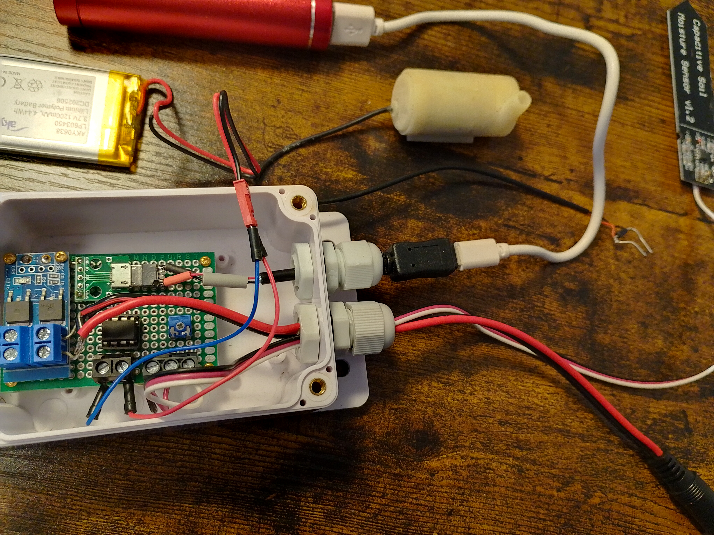
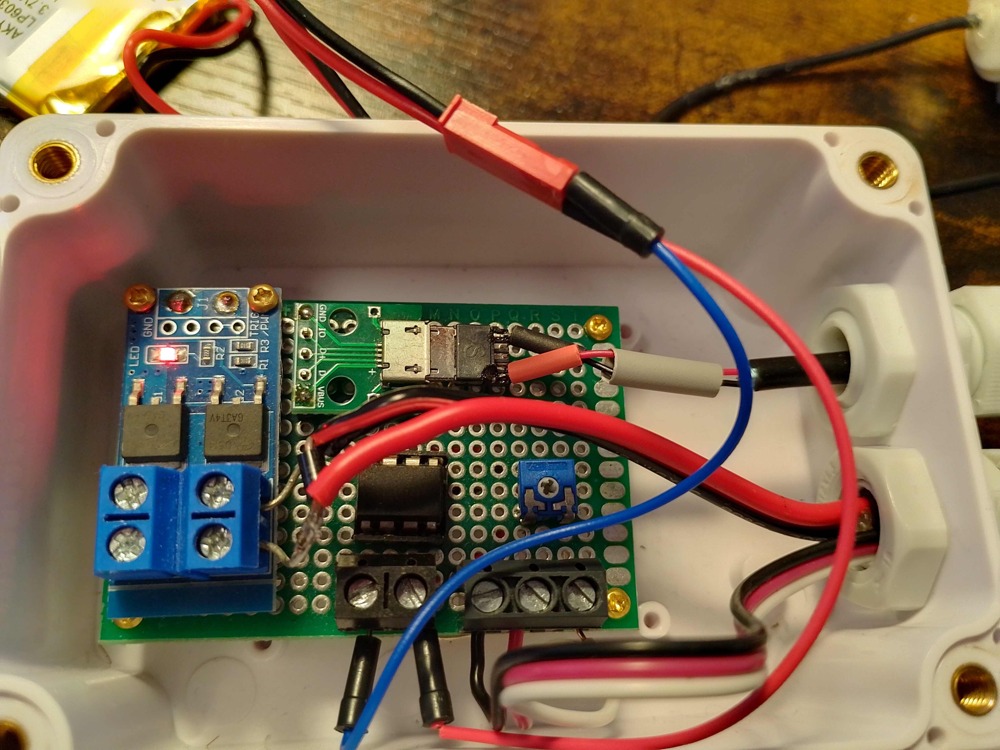

# PumpControl





[Deutsch](#deutsch) | [Español](#español) | [English](#english) 

---

## Deutsch

### ATtiny25 Tauchpumpen-Steuerungssystem

Ein Ultra-Low-Power Mikrocontroller-System für die automatisierte Steuerung von Tauchpumpen mit intelligenter ADC-Kalibrierung und energieeffizientem Betrieb auf ATtiny25.

#### Funktionen

- **Ultra-niedriger Stromverbrauch**: Power-Down-Schlafmodus mit Watchdog-Timer (8-Sekunden-Intervalle)
- **Intelligente ADC-Kalibrierung**: Selbstkalibrierendes Sensorsystem mit Template-basierten Kalibrierungsklassen
- **Hysterese-Steuerung**: Verhindert Pumpenoszillation mit konfigurierbaren Nass-/Trockenschwellenwerten
- **Sicherheits-Timeout**: Maximale Pumpenlaufzeit-Schutz (60 Sekunden Standard)
- **Minimale Hardware**: Läuft auf ATtiny25 (8-Pin-Mikrocontroller)
- **Energieeffizient**: ~200µA Einsparung durch ADC-Energieverwaltung
- **Template-basiertes Design**: Modernes C++17 mit Template-Spezialisierung für verschiedene Datentypen

#### Hardware-Anforderungen

- **Mikrocontroller**: ATtiny25/45/85 (1 MHz interner RC-Oszillator mit CKDIV8)
- **Analoger Sensor**: Angeschlossen an PB3 (Pin 2, ADC3)
- **Pumpensteuerung**: Angeschlossen an PB1 (Pin 6, aktiv HIGH)
- **Stromversorgung**: 3,3V oder 5V (je nach Sensoranforderungen)

#### Pin-Konfiguration

```
ATtiny25 Pinbelegung:
  1 (RESET/PB5) ---- Nicht verwendet
  2 (PB3/ADC3)  ---- Analoger Sensoreingang
  3 (PB4)       ---- Nicht verwendet  
  4 (GND)       ---- Masse
  5 (PB0)       ---- Nicht verwendet
  6 (PB1)       ---- Pumpensteuerungsausgang (HIGH = EIN)
  7 (PB2)       ---- Nicht verwendet
  8 (VCC)       ---- Stromversorgung
```

#### Entwicklungsumgebung

- **IDE**: Atmel Studio 7 (Microchip Studio)
- **Toolchain**: AVR-GCC mit C++17-Unterstützung
- **Ziel**: ATtiny25 mit 1 MHz internem RC-Oszillator
- **Optimierung**: Größenoptimierung (-Os)

#### Installation & Setup

1. **Repository klonen**:
   ```bash
   git clone https://github.com/Haasrobertgmxnet/PumpControl.git
   ```

2. **Projekt öffnen**:
   - `PumpControl.atsln` in Atmel Studio 7 öffnen
   - Sicherstellen, dass ATtiny25 als Zielgerät ausgewählt ist

3. **Fuses konfigurieren** (empfohlen):
   - CKSEL: Interner RC-Oszillator
   - CKDIV8: Aktiviert (1 MHz Betrieb)
   - BOD: Je nach Anwendungsanforderung

4. **Sensor kalibrieren**:
   - Kalibrierungswerte in `main.cpp` anpassen:
   ```cpp
   uint16_t adc_1 = 550;  // ADC-Wert bei trockener Bedingung
   uint16_t adc_2 = 250;  // ADC-Wert bei nasser Bedingung
   uint16_t val_1 = 0;    // Trockenwert (0%)
   uint16_t val_2 = 100;  // Nasswert (100%)
   ```

#### Konfigurationsparameter

Diese Konstanten in `main.cpp` bearbeiten, um das Verhalten anzupassen:

```cpp
// Messintervall (60 Sekunden Standard)
constexpr uint16_t MEASUREMENT_PERIOD_S = 60;

// Hysterese-Schwellenwerte (in Prozent)
constexpr uint16_t THRESHOLD_DRY = 45;  // Pumpe EIN
constexpr uint16_t THRESHOLD_WET = 55;  // Pumpe AUS

// Sicherheits-Timeout (60 Sekunden maximale Laufzeit)
constexpr uint16_t PUMP_MAX_ON_S = 60;

// ADC-Mittelung (8 Samples)
constexpr uint8_t ADC_SAMPLES = 8;
```

#### ADC-Kalibrierungssystem

Das System verfügt über ein ausgeklügeltes Kalibrierungs-Framework:

- **AdcCalib<T>**: Template-Klasse für ADC-zu-physikalischer-Wert-Konvertierung
- **AdcCalibMaintainer<T>**: Dynamische Kalibrierungsanpassung
- **Float/Integer-Unterstützung**: Template-Spezialisierungen für verschiedene Präzisionsbedürfnisse
- **Selbstkalibrierung**: Automatische Anpassung wenn Sensorwerte Grenzen überschreiten

#### Betriebsmodi

1. **Schlafmodus**: Power-Down mit WDT-Interrupt alle 8 Sekunden
2. **Messung**: Aufwachen alle 60 Sekunden, Sensor lesen, zurück zum Schlaf
3. **Pumpe aktiv**: Kontinuierliche Überwachung während Pumpenbetrieb
4. **Kalibrierung**: Automatische Sensorbereichsanpassung

#### Sicherheitsfunktionen

- **Maximale Laufzeit**: Pumpe schaltet automatisch nach 60 Sekunden ab
- **Hysterese-Steuerung**: Verhindert schnelles Ein-/Ausschalten
- **Energieverwaltung**: ADC deaktiviert wenn nicht benötigt (~200µA Einsparung)
- **Watchdog-Schutz**: System-Reset-Fähigkeit
- **Brown-out-Erkennung**: Konfigurierbar über Fuses

#### Stromverbrauch

- **Schlafmodus**: < 10µA (mit ADC aus, BOD deaktiviert)
- **Aktive Messung**: ~1-2mA für kurze Perioden
- **Pumpensteuerung**: Abhängig von externer Pumpenschaltung

---

## Español

### Sistema de Control de Bomba Sumergible ATtiny25

Un sistema de microcontrolador de ultra bajo consumo para control automatizado de bombas de agua sumergibles con calibración ADC inteligente y operación eficiente en ATtiny25.

#### Características

- **Ultra Bajo Consumo**: Modo de sueño power-down con temporizador watchdog (intervalos de 8 segundos)
- **Calibración ADC Inteligente**: Sistema de sensores auto-calibrante con clases de calibración basadas en plantillas
- **Control de Histéresis**: Previene oscilación de la bomba con umbrales húmedo/seco configurables
- **Timeout de Seguridad**: Protección de tiempo máximo de funcionamiento de bomba (60 segundos por defecto)
- **Hardware Mínimo**: Funciona en ATtiny25 (microcontrolador de 8 pines)
- **Eficiente en Energía**: ~200µA de ahorro mediante gestión de energía del ADC
- **Diseño Basado en Plantillas**: C++17 moderno con especialización de plantillas para diferentes tipos de datos

#### Requisitos de Hardware

- **Microcontrolador**: ATtiny25/45/85 (oscilador RC interno de 1 MHz con CKDIV8)
- **Sensor Analógico**: Conectado a PB3 (Pin 2, ADC3)
- **Control de Bomba**: Conectado a PB1 (Pin 6, activo en ALTO)
- **Fuente de Alimentación**: 3.3V o 5V (dependiendo de los requisitos del sensor)

#### Configuración de Pines

```
Distribución ATtiny25:
  1 (RESET/PB5) ---- No usado
  2 (PB3/ADC3)  ---- Entrada Sensor Analógico
  3 (PB4)       ---- No usado  
  4 (GND)       ---- Tierra
  5 (PB0)       ---- No usado
  6 (PB1)       ---- Salida Control Bomba (ALTO = ENCENDIDA)
  7 (PB2)       ---- No usado
  8 (VCC)       ---- Alimentación
```

#### Entorno de Desarrollo

- **IDE**: Atmel Studio 7 (Microchip Studio)
- **Cadena de Herramientas**: AVR-GCC con soporte C++17
- **Objetivo**: ATtiny25 con oscilador RC interno de 1 MHz
- **Optimización**: Optimización de tamaño (-Os)

#### Instalación y Configuración

1. **Clonar Repositorio**:
   ```bash
   git clone https://github.com/Haasrobertgmxnet/PumpControl.git
   ```

2. **Abrir Proyecto**:
   - Abrir `PumpControl.atsln` en Atmel Studio 7
   - Asegurar que ATtiny25 está seleccionado como dispositivo objetivo

3. **Configurar Fuses** (recomendado):
   - CKSEL: Oscilador RC Interno
   - CKDIV8: Habilitado (operación a 1 MHz)
   - BOD: Según requiera su aplicación

4. **Calibrar Sensor**:
   - Modificar valores de calibración en `main.cpp`:
   ```cpp
   uint16_t adc_1 = 550;  // Lectura ADC en condición seca
   uint16_t adc_2 = 250;  // Lectura ADC en condición húmeda
   uint16_t val_1 = 0;    // Valor seco (0%)
   uint16_t val_2 = 100;  // Valor húmedo (100%)
   ```

#### Parámetros de configuración

Edite estas constantes en `main.cpp` para ajustar el comportamiento:

```cpp
// Messintervall (60 Sekunden Standard)
constexpr uint16_t MEASUREMENT_PERIOD_S = 60;

// Hysterese-Schwellenwerte (in Prozent)
constexpr uint16_t THRESHOLD_DRY = 45;  // Pumpe EIN
constexpr uint16_t THRESHOLD_WET = 55;  // Pumpe AUS

// Sicherheits-Timeout (60 Sekunden maximale Laufzeit)
constexpr uint16_t PUMP_MAX_ON_S = 60;

// ADC-Mittelung (8 Samples)
constexpr uint8_t ADC_SAMPLES = 8;
```

#### Sistema de Calibración ADC

El sistema cuenta con un marco de calibración sofisticado:

- **AdcCalib<T>**: Clase plantilla para conversión ADC-a-valor físico
- **AdcCalibMaintainer<T>**: Ajuste dinámico de calibración
- **Soporte Float/Entero**: Especializaciones de plantilla para diferentes necesidades de precisión
- **Auto-Calibración**: Ajuste automático cuando las lecturas del sensor exceden límites

#### Modos de operación

1. **Modo de suspensión**: apagado con interrupción WDT cada 8 segundos
2. **Medición**: activación cada 60 segundos, lectura del sensor, vuelta al modo de suspensión
3. **Bomba activa**: supervisión continua durante el funcionamiento de la bomba
4. **Calibración**: ajuste automático del rango del sensor

#### Funciones de seguridad

- **Tiempo máximo de funcionamiento**: la bomba se apaga automáticamente después de 60 segundos
- **Control de histéresis**: evita el encendido y apagado rápidos
- **Gestión de energía**: el ADC se desactiva cuando no es necesario (ahorro de ~200 µA)
- **Protección Watchdog**: capacidad de reinicio del sistema
- **Detección de caídas de tensión**: configurable mediante fusibles

#### Consumo de energía

- **Modo de reposo**: < 10 µA (con ADC desactivado, BOD desactivado)
- **Medición activa**: ~1-2 mA durante períodos cortos
- **Control de la bomba**: Depende del circuito externo de la bomba

---

## English

### ATtiny25 Submersible Pump Control System

An ultra-low-power microcontroller system for automated control of submersible water pumps with intelligent ADC calibration and energy-efficient operation on ATtiny25.

#### Features

- **Ultra-Low Power**: Power-down sleep mode with watchdog timer (8-second intervals)
- **Intelligent ADC Calibration**: Self-calibrating sensor system with template-based calibration classes
- **Hysteresis Control**: Prevents pump oscillation with configurable wet/dry thresholds
- **Safety Timeout**: Maximum pump runtime protection (60 seconds default)
- **Minimal Hardware**: Runs on ATtiny25 (8-pin microcontroller)
- **Energy Efficient**: ~200µA savings through ADC power management
- **Template-Based Design**: Modern C++17 with template specialization for different data types

#### Hardware Requirements

- **Microcontroller**: ATtiny25/45/85 (1 MHz internal RC oscillator with CKDIV8)
- **Analog Sensor**: Connected to PB3 (Pin 2, ADC3)
- **Pump Control**: Connected to PB1 (Pin 6, active HIGH)
- **Power Supply**: 3.3V or 5V (depending on sensor requirements)

#### Pin Configuration

```
ATtiny25 Pinout:
  1 (RESET/PB5) ---- Not used
  2 (PB3/ADC3)  ---- Analog Sensor Input
  3 (PB4)       ---- Not used  
  4 (GND)       ---- Ground
  5 (PB0)       ---- Not used
  6 (PB1)       ---- Pump Control Output (HIGH = ON)
  7 (PB2)       ---- Not used
  8 (VCC)       ---- Power Supply
```

#### Development Environment

- **IDE**: Atmel Studio 7 (Microchip Studio)
- **Toolchain**: AVR-GCC with C++17 support
- **Target**: ATtiny25 with 1 MHz internal RC oscillator
- **Optimization**: Size optimization (-Os)

#### Installation & Setup

1. **Clone Repository**:
   ```bash
   git clone https://github.com/Haasrobertgmxnet/PumpControl.git
   ```

2. **Open Project**:
   - Open `PumpControl.atsln` in Atmel Studio 7
   - Ensure ATtiny25 is selected as target device

3. **Configure Fuses** (recommended):
   - CKSEL: Internal RC Oscillator
   - CKDIV8: Enabled (1 MHz operation)
   - BOD: As required by your application

4. **Calibrate Sensor**:
   - Modify calibration values in `main.cpp`:
   ```cpp
   uint16_t adc_1 = 550;  // ADC reading at dry condition
   uint16_t adc_2 = 250;  // ADC reading at wet condition
   uint16_t val_1 = 0;    // Dry value (0%)
   uint16_t val_2 = 100;  // Wet value (100%)
   ```

5. **Program Device**:
   - Build and program using your AVR programmer
   - Verify operation with connected hardware

#### Configuration Parameters

Edit these constants in `main.cpp` to customize behavior:

```cpp
// Measurement interval (60 seconds default)
constexpr uint16_t MEASUREMENT_PERIOD_S = 60;

// Hysteresis thresholds (in percent)
constexpr uint16_t THRESHOLD_DRY = 45;  // Turn pump ON
constexpr uint16_t THRESHOLD_WET = 55;  // Turn pump OFF

// Safety timeout (60 seconds maximum runtime)
constexpr uint16_t PUMP_MAX_ON_S = 60;

// ADC averaging (8 samples)
constexpr uint8_t ADC_SAMPLES = 8;
```

#### ADC Calibration System

The system features a sophisticated calibration framework:

- **AdcCalib<T>**: Template class for ADC-to-physical value conversion
- **AdcCalibMaintainer<T>**: Dynamic calibration adjustment
- **Float/Integer Support**: Template specializations for different precision needs
- **Self-Calibration**: Automatic adjustment when sensor readings exceed bounds

#### Operation Modes

1. **Sleep Mode**: Power-down with WDT interrupt every 8 seconds
2. **Measurement**: Wake up every 60 seconds, read sensor, return to sleep
3. **Pump Active**: Continuous monitoring during pump operation
4. **Calibration**: Automatic sensor range adjustment

#### Safety Features

- **Maximum Runtime**: Pump automatically shuts off after 60 seconds
- **Hysteresis Control**: Prevents rapid on/off cycling
- **Power Management**: ADC disabled when not needed (~200µA savings)
- **Watchdog Protection**: System reset capability
- **Brown-out Detection**: Configurable via fuses

#### Power Consumption

- **Sleep Mode**: < 10µA (with ADC off, BOD disabled)
- **Active Measurement**: ~1-2mA for brief periods
- **Pump Control**: Depends on external pump circuitry

---

### Technical Implementation Details / Detalles Técnicos / Technische Implementierungsdetails

#### Class Structure / Estructura de Clases / Klassenstruktur

```cpp
// ADC Calibration Template System
template<typename T>
class AdcCalib;

template<>
class AdcCalib<float> {
    // Float specialization for high precision
};

template<>
class AdcCalib<uint16_t> {
    // Integer specialization for memory efficiency
};

template<typename T>
class AdcCalibMaintainer {
    // Dynamic calibration management
};
```

#### Memory Usage / Uso de Memoria / Speicherverbrauch

- **Flash**: ~2-3KB (depending on optimization)
- **RAM**: ~50-100 bytes
- **EEPROM**: Not used (can be extended for persistent calibration)

#### Timing Characteristics / Características de Tiempo / Timing-Eigenschaften

- **Measurement Cycle**: 60 seconds (configurable)
- **ADC Conversion**: ~100µs per sample
- **Sleep Current**: < 10µA
- **Wake-up Time**: < 1ms from power-down

#### Build Configuration / Configuración de Compilación / Build-Konfiguration

```makefile
# Compiler Flags
-mmcu=attiny25
-std=c++17
-Os (size optimization)
-Wall (all warnings)

# Fuse Settings (recommended)
Low:  0x62 (1MHz internal RC, CKDIV8)
High: 0xDF (default)
```

### Quick Start Example / Ejemplo de Inicio Rápido / Schnellstart-Beispiel

```cpp
#include "adc.h"
#include "adc_calib.h"
#include "add_calib_maintainer.h"

// Calibration setup
AdcCalibMaintainer<uint16_t> calibMaintainer(550, 0, 250, 100);
auto adcCalib = calibMaintainer.Create(1023);

// Main control loop integrated in main()
// Sleep -> Measure -> Decide -> Control -> Repeat
```